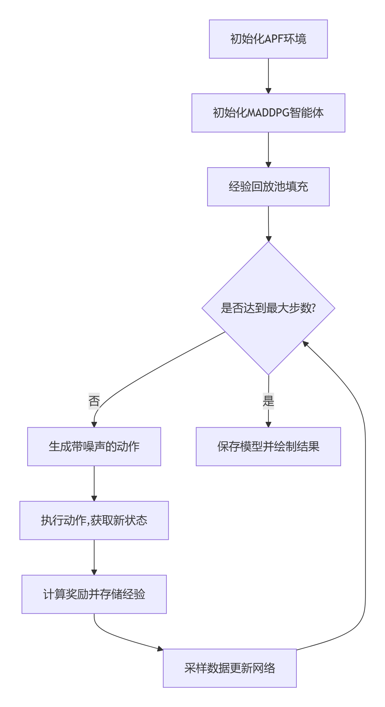

# 面向6G智能协作的单无人机避障算法
> 在避障的同时，无人机根据6G基站情况选择合适的路径，选择最优信道进行通信。

### conda环境
```bash
conda create -n torch python=3.10
conda activate torch
```
#### Requirements
- numpy
- torch
- matplotlib

#### 训练
python main.py

#### 测试
python test.py

#### 画图、可视化
打开matlab运行
```matlab
drawAndTest
```
##### 项目思路



##### 训练流程
