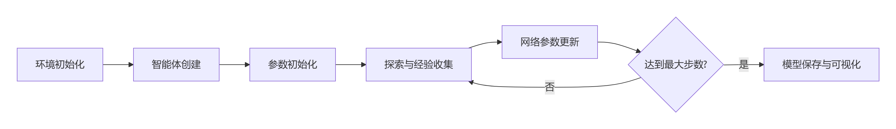

# 多智能体深度确定性策略梯度（MADDPG）算法

# Graphic
graph TD
    A[初始化APF环境] --> B[初始化MADDPG智能体]
    B --> C[经验回放池填充]
    C --> D{是否达到最大步数?}
    D -->|否| E[生成带噪声的动作]
    E --> F[执行动作,获取新状态]
    F --> G[计算奖励并存储经验]
    G --> H[采样数据更新网络]
    H --> D
    D -->|是| I[保存模型并绘制结果]

## 训练流程
graph LR
    A[环境初始化] --> B[智能体创建]
    B --> C[参数初始化]
    C --> D[探索与经验收集]
    D --> E[网络参数更新]
    E --> F{达到最大步数?}
    F -->|否| D
    F -->|是| G[模型保存与可视化]

